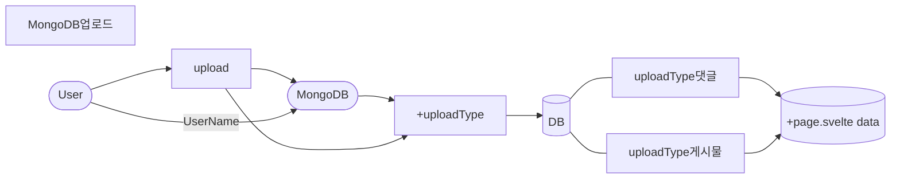

```mermaid

flowchart LR
    MongoDB업로드
    page[(+page.svelte data)]
    DB([MongoDB])
    user([User])
    Data[(DB)]
    user -->upload--> DB
    user --UserName--> DB
    DB-->+uploadType-->Data
    upload-->+uploadType
    
    Data --- uploadType댓글
    Data --- uploadType게시물
    uploadType댓글 --> page
    uploadType게시물 --> page
```