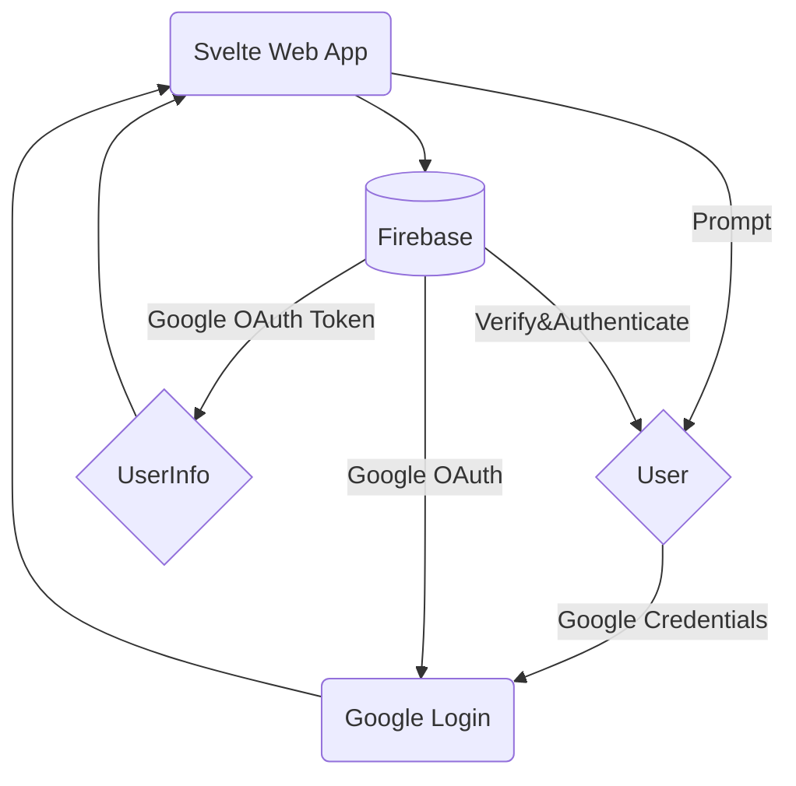

```mermaid
graph TD
B(Svelte Web App)--Prompt--> C{User}
C --Google Credentials-->A(Google Login)--> B
B --> D[(Firebase)]
D --Verify&Authenticate--> C
D --Google OAuth Token--> E{UserInfo}
E --> B
D--Google OAuth-->A
```