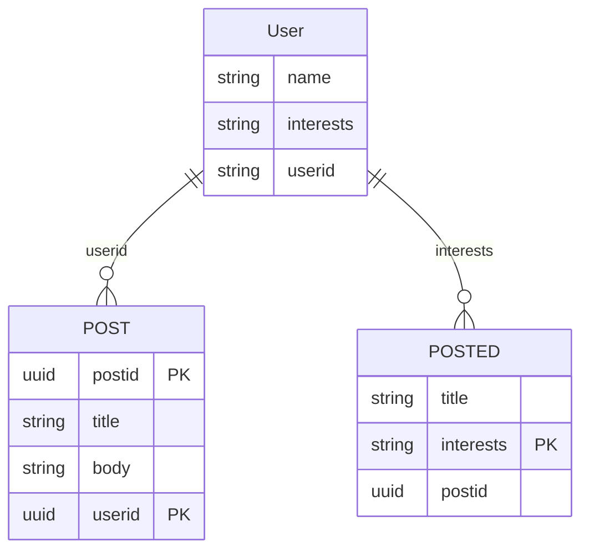

```mermaid

erDiagram
    User ||--o{ POST : userid
    User {
        string name
        string interests
        string userid
    }
    User ||--o{ POSTED : interests
    POSTED {
        string title
        string interests PK
        uuid postid
    }
    POST {
        uuid postid PK
        string title
        string body
        uuid userid PK
    }
```